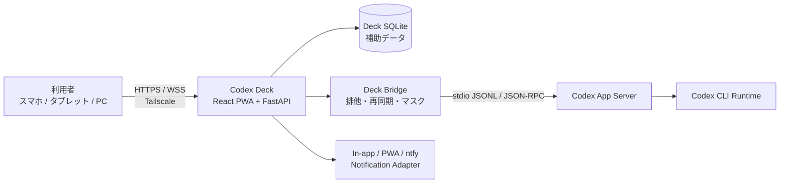

# Codex Deck プロジェクト仕様書

## 1. 文書の目的

本書は、Codex Deckの現在仕様、想定構成、外部インターフェース、実装状況、確認状況を横断的に整理する。

上位の目的、要件、対象範囲、主要文書への導線は[README.md](README.md)で定義する。本書ではそれらを現在仕様と実装・確認状況へ展開する。AIセッション間で引き継ぐ短い判断と次の作業は[PROJECT_CONTEXT.md](PROJECT_CONTEXT.md)に記録する。

## 2. プロジェクト概要

### 2.1 背景

Windows開発PC上のCodex作業を外出先から確認・操作するには、リモートデスクトップよりも、Codexの会話、承認、差分、実行状況を端末に適した情報構造で扱えるクライアントが必要である。

### 2.2 目的

Codex CLI、VS Code拡張、Codex App Serverの公式概念を尊重し、スマートフォン、タブレット、PCブラウザでCodex作業の依頼、監視、レビュー、承認、復帰を行えるWebクライアントを提供する。

### 2.3 想定利用者

- Windows PC上で個人開発を行う利用者
- Codex作業をスマートフォンやタブレットで確認・承認する利用者
- 要件、PoC、実装状況をレビューする開発者または保守担当者

### 2.4 仕様上の前提

- CodexのThread、Turn、Item、approval policy、sandbox設定が正本である。
- Deckは独自会話、独自承認、独自Git制限を作らない。
- App Serverの外部WebSocket公開はMVPの経路にしない。Deck BridgeがWindows PC内のstdio JSONLで接続する。
- workspaceはフォルダ単位であり、Gitリポジトリを必須としない。
- 1 workspaceのActive workは1件とし、別workspaceの並行実行はPoC合格を前提とする。

## 3. システム構成

以下は実装済み構成ではなく、要件定義で採用を推奨した想定構成である。



| 要素 | 配置 / 分類 | 役割 | 現在の状態 |
| --- | --- | --- | --- |
| Codex Deck Frontend | Windows PCで配信、モバイル/PCブラウザで利用 | モバイル最適化UI、WebSocket受信、閲覧・引用・承認 | 設計中 |
| Codex Deck Backend | Windows PC | 認証、API、リアルタイム配信、workspace/Git/File Adapter | 設計中 |
| Deck Bridge | Windows PC | App Server stdio管理、イベント正規化、排他、再接続、マスク | 設計中 |
| Codex App Server | Windows PC、Deck Bridgeの子プロセス | Thread、Turn、Item、公式承認、Codex連携 | 公式機能を調査済み。PoC未実施 |
| Deck SQLite | Windows PC、Deck専用 | workspace、表示設定、通知、未読、event受信位置、監査補助 | 未実装 |
| Notification Adapter | Windows PC→端末 | アプリ内通知、PWA push、ntfy配送 | 設計中 |

## 4. 機能一覧

| 機能 | 状態 | 目的 | 主な内容 | 関連資料 |
| --- | --- | --- | --- | --- |
| 公式Codex連携 | 設計中 | Thread/Turn/Itemを正しく扱う | stdio JSON-RPC、初期化、開始、再開、停止、承認 | `docs/research/CODEX_OFFICIAL_CAPABILITY_RESEARCH.md` |
| workspace管理 | 設計中 | 許可済みフォルダで安全に作業する | 登録、最近使用、favorite、Git要約、1 workspace 1 active work | `docs/requirements/CODEX_DECK_REQUIREMENTS.md` |
| セッション管理 | 設計中 | Codex Threadを検索・新規・再開する | 一覧、状態、検索、filter、archive、PoCに基づく共有 | `docs/requirements/CODEX_DECK_USE_CASES.md` |
| 作業・承認表示 | 設計中 | 実行状態を判断可能にする | 発言、進捗、Tool、command、approval、error、完了 | `docs/requirements/CODEX_DECK_REQUIREMENTS.md` |
| ファイル/コード閲覧 | 設計中 | 読み取り専用で確認・引用する | tree、search、line/selection引用、deny/mask | `docs/design/CODEX_DECK_SCREEN_MAP.md` |
| Git差分 | 設計中 | 端末別に変更をレビューする | mobile inline、tablet/PC side-by-side、会話リンク | `docs/design/CODEX_DECK_SCREEN_MAP.md` |
| コマンド/テスト表示 | 設計中 | Codex実行結果を確認する | stdout/stderr、終了コード、構造化結果、生ログ | `docs/requirements/CODEX_DECK_USE_CASES.md` |
| 通知・復旧 | 設計中 | 切断中も重要状態を逃さない | in-app/PWA/ntfy、event replay、snapshot、Windows再起動後の中断表示 | `docs/poc/CODEX_DECK_POC_PLAN.md` |
| Windows運用 | 設計中 | 安定起動・監視を行う | task scheduler、launcher、health、ログ、復旧 | `docs/requirements/CODEX_DECK_RISKS.md` |

## 5. 設定と入力資産

| 資産 | 役割 | 管理方針 | 現在の状態 |
| --- | --- | --- | --- |
| Codexユーザー設定 | Codex model、approval、sandbox、MCP等 | `~/.codex/config.toml`は個人設定。Deckが複製・編集しない。 | 外部前提 |
| プロジェクト設定例 | 移植可能なCodex既定値の例 | `.codex/config.toml.example`のみを管理。秘密情報/端末パスを含めない。 | 配置済み |
| Deck設定 | port、許可root、通知、保持期間等 | 実装開始後にDeck専用設定として設計する。SMAIと共有しない。 | 未実装 |
| Deck SQLite | 補助状態 | Thread本文やtokenを保存しない。バックアップ・ローテーション対象。 | 未実装 |
| PoC証跡 | 互換性、性能、復旧の確認 | token、実会話本文、個人ファイルを除外し、マスク済みで保存する。 | 未作成 |

## 6. 実装構成

### 6.1 現在のディレクトリ構成

```text
Codex_Deck/
├── README.md
├── Project_Specification.md
├── PROJECT_CONTEXT.md
├── AGENTS.md
├── CLAUDE.md
├── .codex/
│   └── config.toml.example
├── .claude/
│   └── settings.json.example
├── documents/
│   └── ai/
│       ├── AI_Working_Rules.md
│       └── Tool_Configuration_Guide.md
└── docs/
    ├── design/
    ├── poc/
    ├── requirements/
    └── research/
```

アプリ本体の`frontend/`、`backend/`、依存関係、実行スクリプトはまだ作成していない。

### 6.2 実装開始後の責務境界

| 想定モジュール | 責務 | 境界 |
| --- | --- | --- |
| Frontend | 端末別レイアウト、composer、作業表示、読み取り専用ビュー | Codex/App Serverへ直接接続しない。 |
| Backend API | Deck API、認証、WebSocket、通知、UI補助状態 | Codex Thread正本やユーザーtokenをDBへ複製しない。 |
| Bridge | App Server stdio、JSON-RPC、event順序、再同期、mask、process監視 | 実装する公式APIを対象バージョンschemaに合わせる。 |
| Scheduler | workspace lock、Active work、停止/中断、再起動時の状態遷移 | 前回Turnの自動再実行を禁止する。 |
| File/Git Adapter | 許可root配下の読み取り、Git状態/diff、deny/mask | 直接編集・自由なOS探索を提供しない。 |
| Notification Adapter | in-app/PWA/ntfyの配送・既読・quiet hours | SMAIのコード、DB、設定、topicと共有しない。 |

## 7. 外部インターフェース

| インターフェース | 状態 | プロジェクト上の扱い |
| --- | --- | --- |
| Codex App Server | 公式仕様確認済み、PoC必要 | stdio JSONL/JSON-RPCをMVPの正規経路とする。WebSocket直接公開はしない。 |
| Codex CLI | 公式仕様確認済み、PoC必要 | version/schemaを記録し、Thread共有とWindows運用をPoCする。 |
| VS Code Codex拡張 | 一部公式確認済み、PoC必要 | CLI/DeckとのThread共有・競合は保証済みとして扱わない。 |
| Tailscale | 設計対象 | Deckへの限定アクセス、端末失効、identityの利用方法をPoCする。 |
| PWA push | 設計対象 | iOS/iPadOSの制約をPoCし、in-app/ntfyをfallbackとする。 |
| ntfy | 設計対象 | Deck専用設定・topic・ログで運用する。SMAIとは共有しない。 |

## 8. テストと確認状況

### 8.1 方針

- 通常のunit/integrationは、fake App Server、fixture、record/replayを使い、network-freeかつdeterministicにする。
- 実Codex、Tailscale、PWA push、iOS/iPadOS、Windows再起動はPoC/live smokeとして分離する。
- 文書変更では、リンク、Markdownコードフェンス、末尾空白、`git diff --check`相当の確認を行う。

### 8.2 確認済み内容

| 確認日 | 内容 | 環境 | 結果 |
| --- | --- | --- | --- |
| 2026-07-13 | OpenAI公式資料とローカルCLIによるApp Server、CLI、Windows設定の調査 | Windows、`codex-cli 0.144.1` | 確認済み/PoC必要/未確認を分類済み |
| 2026-07-13 | 要件定義文書群のローカルリンク、コードフェンス、末尾空白、Git whitespace確認 | 本リポジトリ | 通過 |
| 2026-07-14 | AI文書体系の導入 | 本リポジトリ | 導入済み。アプリ実装・PoCは未実施 |
| 2026-07-14 | P0-0とP0-1基本経路 | Windows、`codex-cli 0.144.1` | schema生成、stdio handshake、Thread/Turn/Item/完了/resumeを確認。詳細は`docs/poc/CODEX_DECK_POC_RESULTS.md`。 |

### 8.3 未確認範囲

- App Serverのstdio接続、承認、Itemイベント、`turn/steer`、`turn/interrupt`の実機検証
- CLI、VS Code、Deck間のThread共有と同時操作競合
- workspace別並行実行、ブラウザ/App Server/Windows再起動時の復旧
- iOS/iPadOS PWA、push通知、background復帰
- Smart_Market_AI規模のファイル、diff、pytestログの性能

## 9. 現在の実装状況

| 領域 | 状態 | 内容 |
| --- | --- | --- |
| 要件定義 | 確認済み | 要件、ユースケース、画面設計、PoC、リスク、公式調査を作成済み。 |
| AI文書体系 | 確認済み | README、仕様書、継続コンテキスト、AI指示、共通ルール、設定例を本プロジェクトへ導入済み。 |
| App Server PoC | 一部確認済み | P0-0完了、P0-1の基本経路を確認。承認・steer・interrupt・障害・P0-2は未判定。 |
| アプリ本体 | 未着手 | framework、frontend、backend、DB、設定、依存関係を未作成。 |
| Windows運用 | 未着手 | task scheduler/launcher/health設計のみ。 |

## 10. 関連資料・参考URL

### 10.1 プロジェクト文書

| 資料 | 役割 |
| --- | --- |
| `README.md` | 上位目的、要件、対象範囲、入口 |
| `Project_Specification.md` | 現在仕様、構成、実装・確認状況 |
| `PROJECT_CONTEXT.md` | AI引き継ぎの判断、進捗、未決事項、次の作業 |
| `AGENTS.md` / `CLAUDE.md` | AIツールの作業入口 |
| `documents/ai/AI_Working_Rules.md` | AIツール共通の作業ルール |
| `docs/requirements/CODEX_DECK_REQUIREMENTS.md` | メイン要件定義書 |
| `docs/research/CODEX_OFFICIAL_CAPABILITY_RESEARCH.md` | 公式仕様調査結果 |

### 10.2 外部参考URL

| 名称 | URL | 用途 |
| --- | --- | --- |
| Codex App Server | https://learn.chatgpt.com/docs/app-server | JSON-RPC、Thread、Turn、Item、approval、transportの公式仕様 |
| Codex configuration | https://learn.chatgpt.com/docs/config-file/config-basic | CLI/IDE共通設定、sandbox、approvalの公式情報 |
| Codex AGENTS.md | https://learn.chatgpt.com/docs/agent-configuration/agents-md | Codexの指示ファイル探索と優先順位 |
| Codex Windows sandbox | https://learn.chatgpt.com/docs/windows/windows-sandbox | Windows native sandboxと運用上の前提 |

## 11. 更新方針

- アプリ実装やPoCにより現在仕様・構成・確認状況が変わったら本書を更新する。
- 設計上の未決事項、判断理由、次の作業は本書へ長く追記せず、`PROJECT_CONTEXT.md`または該当する`docs/`文書へ記録する。
- 実装開始後も、本書を最終成果物の整理先にせず、実装・テストと同じ変更単位で更新する。
