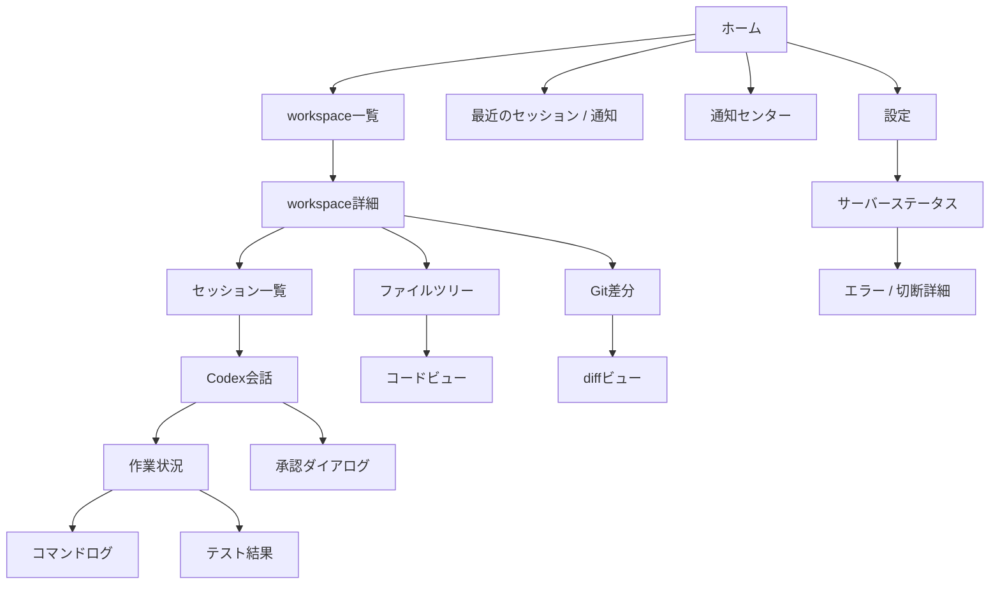

# Codex Deck 画面一覧・情報設計

## 1. 文書情報

| 項目 | 内容 |
| --- | --- |
| 対象 | Codex Deck MVPの画面構成、画面間遷移、端末別レイアウト |
| 前提 | [要件定義書](../requirements/CODEX_DECK_REQUIREMENTS.md)、[ユースケース](../requirements/CODEX_DECK_USE_CASES.md) |
| UI原則 | Codex公式のThread/Turn/Item/approvalを忠実に表現し、スマホをPCレイアウトの縮小版にしない。 |

## 2. 情報アーキテクチャ



## 3. ナビゲーション方針

### 3.1 スマートフォン

下部ナビゲーションは、現在のThreadで最も頻繁に往復する5領域に限定する。

| 順序 | 項目 | 主目的 | バッジ |
| --- | --- | --- | --- |
| 1 | 会話 | 指示、質問への回答、Codex発言の確認 | 未読、回答待ち |
| 2 | 作業 | 進捗、計画、Tool/Item、承認待ちの確認 | 実行中、承認待ち |
| 3 | 差分 | Git差分のレビューと引用 | 未確認差分数 |
| 4 | ファイル | ツリー、検索、コード参照 | 変更ファイル数 |
| 5 | 実行 | コマンド、テスト、終了状態 | 失敗数、実行中 |

- workspace切替、セッション一覧、通知、設定は上部ヘッダ/overflow menuから開く。
- composerは「会話」内で下部固定を基本とし、キーボード表示中はvisual viewportに追従する。
- 承認待ちは下部タブのバッジ、sticky banner、通知を組み合わせて見落としを防ぐ。
- ファイルツリーは常設列にせずdrawerとする。diffはスマホで横スクロール前提にせずインライン表示する。

### 3.2 タブレット・PC

| 区分 | 基本ナビゲーション | 目的 |
| --- | --- | --- |
| タブレット縦 | workspace/セッションは左rail、作業領域は2ペイン | 会話とレビュー対象を同時表示する。 |
| タブレット横 | 左ファイル、中央コード/diff、右会話/作業、下部実行 | レビューの往復回数を減らす。 |
| PC | 可変幅multi-pane、左activity bar、上部breadcrumb | VS Codeに近い情報密度だが、編集機能は含めない。 |

ペイン幅、折畳み、選択タブ、フォントサイズ、最終スクロール位置は端末ごとの補助設定として保存する。端末間で会話やCodex設定を複製しない。

## 4. 画面一覧

| ID | 画面 | 目的 | 主な情報/操作 | 優先端末 |
| --- | --- | --- | --- | --- |
| SC-01 | ホーム | 現在の重要事項を一画面で把握 | Active work、承認待ち、質問、最近のworkspace、最近の通知、サーバー状態 | 全端末 |
| SC-02 | workspace一覧 | 作業先を選ぶ | 最近使用、favorite、Git状態、Active work、追加 | 全端末 |
| SC-03 | workspace詳細 | workspaceの入口 | セッション、Git要約、ファイル、最近の作業、登録情報 | 全端末 |
| SC-04 | セッション一覧 | Threadを探し再開する | title、状態、最終更新、検索、filter、archive | 全端末 |
| SC-05 | Codex会話 | 依頼・回答・明示発言を読む/送る | composer、Markdown preview、引用、質問、追加指示、停止 | 全端末 |
| SC-06 | 作業状況 | Codex Itemを時系列に監視 | 計画、Tool、コマンド、ファイル変更、進捗、状態 | 全端末 |
| SC-07 | ファイルツリー | 読み取り対象を探す | tree、検索、Git badge、除外、lazy loading | 全端末 |
| SC-08 | コードビュー | コードを読む・引用する | 行番号、検索、折返し、font、selection/line quote | 全端末 |
| SC-09 | Git差分 | 変更をレビュー・引用する | inline/side-by-side、hunk、context、未確認、会話リンク | 全端末 |
| SC-10 | コマンドログ | Codex実行コマンドを確認 | cwd、開始/終了、stdout/stderr、検索、copy、autofollow | 全端末 |
| SC-11 | テスト結果 | テスト結果を構造化・原ログで確認 | summary、failure、stack trace、file link、full log | 全端末 |
| SC-12 | 承認ダイアログ | 公式承認を判断する | reason、対象、access mode、公式decision | 全端末 |
| SC-13 | 通知センター | 重要イベントを再確認する | 未読、種別、配送状態、対象Thread遷移 | 全端末 |
| SC-14 | 設定 | Deck補助設定を調整 | theme、表示、通知、許可workspace、端末、保持期間 | PC/タブレット中心 |
| SC-15 | サーバーステータス | Deck/App Serverの稼働を確認 | readiness、Bridge、DB、disk、restart、version | PC/タブレット中心 |
| SC-16 | エラー・切断 | 回復可能な障害を説明する | 接続状態、再試行、event gap、ログID、戻る先 | 全端末 |

## 5. 主要画面仕様

### SC-01 ホーム

**目的:** 「今すぐ返答・承認すべきこと」と「動いている作業」を最初に示す。

| 領域 | 内容 |
| --- | --- |
| Attention rail | 承認待ち、回答待ち、エラーを優先順位順に表示。何もなければ「要対応なし」。 |
| Active work | workspace名、Thread名、公式状態、最終Item、経過、接続状態、開く操作。 |
| Recent workspaces | favorite/最近使用、Git要約、最終利用時刻、新規セッション。 |
| Recent notifications | 重要通知の未読、既読、対象へのdeep link。 |
| Server chip | Deck/Bridgeの接続状態。Codexの作業状態と混同しない。 |

スマホではAttention rail → Active work → Recent workspaceの1カラム。タブレット/PCではAttentionとActive workを上段2列にし、幅が狭いと1列へ戻す。

### SC-02 workspace一覧 / SC-03 workspace詳細

**workspace一覧のカード項目:** 表示名、root path、favorite、Git/非Git、branch、変更数、Active work、最終使用、直近Thread。

**workspace詳細のtabs:** `セッション`、`ファイル`、`差分`、`状態`。スマホではセッションを既定表示し、詳細tabsは画面内切替にする。

**追加フロー:** 許可ルート内のfolder picker → Git/deny規則の検査 → 表示名確認 → 登録。root外やcredential領域を示すパスは選択できない。

### SC-04 セッション一覧

| 要素 | 仕様 |
| --- | --- |
| Filter | 状態（active/completed/interrupted/error/approval/question/archived）、workspace、期間、favorite、source（利用可能な場合）。 |
| Search | Thread title/name、workspace、表示名を対象。会話本文の独自全文インデックスはMVP対象外。 |
| Row | title、状態chip、最終更新、workspace、最終発言要約（マスク後）、未読、archive。 |
| Action | 新規、再開、アーカイブ。分岐は公式API/PoCが確認されるまでdisabled理由を表示する。 |
| Shared indicator | CLI/VS Code起点と判定できる情報が公式に得られる場合のみ表示する。推測でsourceを付与しない。 |

### SC-05 Codex会話

**表示構造**

```text
[workspace / session title / status / access mode / connection]
| ユーザー発言                                       |
| Codexの明示発言（Markdown、安全なファイル/行リンク） |
| 進捗更新（短い要約。必要なら作業タブへリンク）      |
| 質問・承認要求（sticky / inline）                   |
-----------------------------------------------------
| 引用chip / 下書き復元 / composer / 送信             |
```

- Codexの明示発言と、Deckが受信した進捗は視覚的に区別する。進捗を推論の表示に見せない。
- Markdownは安全なsubsetでrenderし、外部リンク・ファイルリンクは明示ラベルを付ける。
- composerの機能は自動拡張、全画面、preview、template、履歴再利用、clipboard、IME保護、下書き復元。
- `追加指示`は実行中Turnで公式サポート/PoC合格の場合だけ表示する。`停止`は確認なしで実行するボタンにせず、対象Thread/Turnを明示する。

### SC-06 作業状況

| Item種別 | 表示方針 |
| --- | --- |
| agent message / progress | 短いtimeline。会話の該当位置へリンク。 |
| plan | Codexが明示した計画のみを表示。Deckが独自にタスクを推定しない。 |
| tool / file read | 既定で折畳み。path/対象/結果をマスク後に表示。 |
| command | コマンドカード。実行タブの全文ログへリンク。 |
| file change / patch | ファイルとdiffへのリンク。直接編集操作は置かない。 |
| approval / question | 画面上部へ昇格し、状態色だけでなくラベルとactionを示す。 |
| error / completed | terminal state、時刻、関連ログ、次の安全な操作。 |

タイムラインにはDeck受信時刻を表示できるが、Codex公式の発生時刻と区別する。未知ItemはIDと種類を残し、内容は安全に折畳む。

### SC-07 ファイルツリー / SC-08 コードビュー

**ファイルツリー:** Git badge、folder collapse、lazy loading、file/folder search、`.gitignore`、独自除外、binary/large/symlinkの状態。treeの選択はコードビューを開くのみで編集へ遷移しない。

**コードビュー:** 左gutterの行番号、syntax highlight、検索、line jump、wrap toggle、font scale、copy、selection copy、path/line/selection quote。上部に常時「読み取り専用」chipを置く。Codexが参照・変更した位置は、公式Itemとの対応を確認できる場合に限り控えめにhighlightする。

### SC-09 Git差分

| 端末 | 既定 | 補助操作 |
| --- | --- | --- |
| スマホ | インラインdiff | hunk展開、前後context、ファイル移動、引用、font scale |
| タブレット縦 | 利用幅に応じinline/side-by-sideを選択 | 横持ち切替、ペイン全画面 |
| タブレット横/PC | side-by-side | file list、minimap、hunk navigation、会話リンク |

差分画面は未コミット、staged、unstaged、HEAD比較、必要時commit/branch比較をcontext selectorとして表示する。binary/rename/削除は安全なメタ情報を提示し、テキスト差分を偽造しない。

### SC-10 コマンドログ / SC-11 テスト結果

**コマンドログ:** command、cwd、start/end、duration、exit code、stdout/stderr、ANSI、copy、search、follow。実行・停止ボタンはCodexの公式Item/APIで対応できる場合だけ表示し、汎用シェル入力欄を置かない。

**テスト結果:** parserが認識したときだけsummary（例: success/failure/skip/duration）、failure list、stack trace、関連コードへリンクを示す。認識できない出力は生ログを正として「構造化できません」と表示する。再実行はCodexに送る依頼テンプレートであり、ブラウザが直接コマンドを打たない。

### SC-12 承認ダイアログ

```text
承認待ち [Thread] [Turn] [アクセスモード]
理由
対象: command / file change / network / permission
詳細: command + cwd または path/change、host/protocol/port

[公式のAccept] [Accept for session] [Decline] [Cancel]
```

- command、file change、network、permissionを混同しない。
- 公式APIが返したavailable decisionだけを有効にする。
- 「今回のみ」「セッション中」は、公式値との対応を併記する。
- 操作後はpendingを即時消さず、`serverRequest/resolved`または結果Itemを待って結果を示す。

### SC-13 通知センター / SC-14 設定

**通知センター:** type、重要度、時刻、Thread/workspace、既読、配送channel、対象への移動。既読はDeck補助状態であり、Codex Itemを変更しない。

**設定:** theme、文字/コードサイズ、motion、layout、workspace登録、notification種別/quiet hours/PWA permission/ntfy、ログ保持、端末セッション。Codexのapproval/sandboxは「現在のCodex設定」として表示しても、Deck任意値として保存・改変しない。

### SC-15 サーバーステータス / SC-16 エラー・切断

| 表示項目 | 内容 |
| --- | --- |
| Deck Backend | version、uptime、ready/live、WebSocket接続数、再起動回数 |
| Deck Bridge | Codex CLI version、App Server PID、handshake、直近イベント、終了コード、schema version |
| Storage | SQLite健全性、バックアップ日時、ログ容量、ディスク空き |
| Scheduler | workspace lock、Active work、滞留/timeout、孤立プロセスチェック |
| Error action | 再接続、状態再取得、マスク済み診断IDコピー、管理者に連絡。Codex作業の無断再実行は置かない。 |

## 6. 端末別ワイヤーフレーム

### 6.1 スマートフォン

```text
┌──────────────────────────────┐
│ < workspace / Thread / 状態  │
│ 承認待ち・接続状態 banner     │
├──────────────────────────────┤
│                              │
│   選択中タブの1カラム本文      │
│   会話 / 作業 / 差分 ...       │
│                              │
├──────────────────────────────┤
│ 引用chip                      │
│ composer                [送信]│
├──────────────────────────────┤
│ 会話 | 作業 | 差分 | ファイル | 実行 │
└──────────────────────────────┘
```

最小tap targetは44 CSS pxを目標とし、destructive/approval actionは十分な間隔と確認対象の名称を置く。ノッチ・home indicator・ソフトウェアキーボードでcomposerや承認actionが隠れない。

### 6.2 タブレット縦

```text
┌───────────────┬─────────────────────────┐
│ 会話 / 作業    │ コード / diff / テスト   │
│ セッション     │                         │
│ ファイル       │                         │
├───────────────┴─────────────────────────┤
│ composer / status                         │
└─────────────────────────────────────────┘
```

### 6.3 タブレット横・PC

```text
┌────────────┬─────────────────────┬───────────────────┐
│ Activity   │ Code / Diff          │ 会話 / 作業        │
│ workspace  │ breadcrumb            │ status / approval │
│ file tree  │                       │ composer          │
├────────────┴─────────────────────┴───────────────────┤
│ Command / Test（必要時に展開、可変高）                 │
└──────────────────────────────────────────────────────┘
```

ペインは明示的に折畳み・全画面化でき、横幅不足時は中央を最優先し、左tree→下部実行→右会話の順にoverlay/drawerへ退避する。

## 7. 状態・エラー表現

| 状態 | 表示 | 利用者に可能な操作 |
| --- | --- | --- |
| 待機中 | neutral chip | 新規、再開、閲覧 |
| 調査/実行/コマンド/テスト中 | progress label + elapsed | 閲覧、PoC合格時の追加指示、停止 |
| 承認待ち | high-attention banner + badge | 公式decision |
| 回答待ち | question card + badge | 回答 |
| 停止処理中 | pending label | 重複停止を無効化 |
| 中断 | reason + last event | 明示再開、確認のみ |
| 完了 | final summary | diff/ログ確認、新規/再開 |
| エラー | error summary + diagnostic ID | 状態取得、再接続、ログ確認 |
| App Server切断 | Bridge disconnected | Codex状態を断定せず、再接続/最新確認 |
| ブラウザオフライン | Browser offline | 下書き保存、送信禁止 |

## 8. アクセシビリティ・表示品質

- すべてのicon actionにaccessible nameを付ける。状態は色だけで示さない。
- `aria-live`は承認/質問/重大エラーだけをassertiveにし、ログdeltaを過剰に読み上げない。
- motion削減設定ではstreaming animationを最小化し、文字列と時刻で更新を伝える。
- dark/light/OS追従、拡大文字、code font sizeを端末ごとに維持する。
- Markdownの表、コード、diffは横スクロールをcomponent内に閉じ、ページ全体の意図しない横スクロールを作らない。
- 空、読込中、切断、権限不足、未対応、巨大ファイル、binary、parser失敗を別々の状態として説明する。

## 9. UI受入確認

| 確認項目 | 合格基準 |
| --- | --- |
| iPhone 13 mini相当 | 下部nav/composer/承認actionがsafe areaとkeyboardで隠れず、横スクロールなしで主要操作できる。 |
| 一般スマホ | 会話、作業、差分、ファイル、実行を1カラムで切替でき、diffが読める。 |
| iPad縦 | 会話/作業とコード/diffを2ペインで同時に扱える。 |
| iPad横 | 3ペイン+実行領域が重ならず、向き変更で選択状態が失われない。 |
| PC | 画面をVS Codeの単純複製にせず、閲覧・承認・レビューに必要なペインだけを可変表示する。 |
| 読み取り専用 | どの端末でも直接編集可能に見えるcaret/save/edit操作がない。 |
| 接続断 | オフライン時に送信済みと表示せず、再同期状態と最後の受信位置を示す。 |
