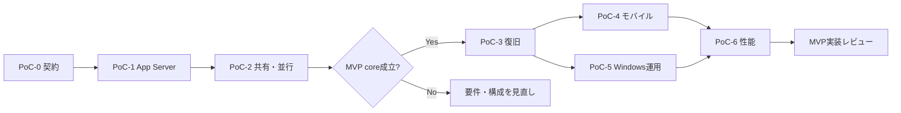

# Codex Deck PoC計画書

## 1. 目的と実施原則

Codex Deckの実装前に、公式仕様で存在が確認できても、Windows・CLI・VS Code・モバイルPWA・複数クライアントの組合せで保証範囲が不明な事項を検証する。

PoCはアプリ本体の実装ではない。各PoCは小さな検証用スクリプト/記録に限定し、結果を[公式機能調査](../research/CODEX_OFFICIAL_CAPABILITY_RESEARCH.md)と[要件定義書](../requirements/CODEX_DECK_REQUIREMENTS.md)へ反映する。実施結果は[PoC実施結果](CODEX_DECK_POC_RESULTS.md)に記録する。秘密情報、実際の認証token、会話本文、個人ファイルは成果物に含めない。

## 2. 共通実施環境

| 項目 | 基準 |
| --- | --- |
| OS | Windows 11を推奨。Windows 10の場合はbuildとConPTY条件を記録する。 |
| Codex | 実施時の`codex --version`、`codex app-server --help`、生成schemaのhashを記録する。 |
| VS Code | `code --version`と`openai.chatgpt`拡張versionを記録する。 |
| Workspace | 使い捨てPoC workspaceと、性能用のSmart_Market_AI read-only clone/許可済み作業treeを分ける。 |
| ネットワーク | App Serverはstdioを既定とする。Deck側のTailscale、PWA push、ntfyを検証するときだけ必要最小限の通信を許可する。 |
| ログ | UTCとJST、Thread/Turn/Item ID、PID、終了コード、イベント順、マスク済み出力だけを記録する。 |
| 安全 | `danger-full-access`の検証は使い捨てworkspaceで行い、実ユーザーデータ/credentialディレクトリを対象にしない。 |

### 2.1 共通観測項目

1. Codex CLI/IDE/App Serverのバージョン。
2. 起動方法、実行アカウント、`CODEX_HOME`の種類（値そのものは公開しない）。
3. JSON-RPC request/response/notificationのmethod、順序、Thread/Turn/Item ID。
4. App Server、Deck検証ツール、子プロセスのPIDと終了コード。
5. 一時切断、再接続、再起動、ブラウザ再表示の時刻。
6. Git状態、差分、作業treeのハッシュ。検証前後に不要変更がないこと。
7. CPU、メモリ、ディスク、ネットワーク量（性能PoCのみ）。

### 2.2 合否ルール

- **合格:** 成功条件を満たし、期待しない再実行・二重操作・secret露出がない。
- **条件付合格:** 基本目的は満たすが、制限をMVP要件/画面に明記する必要がある。
- **不合格:** 代替案を採用しても必須要件を満たせない。該当機能をMVPから外すか、設計を見直す。
- **未判定:** 外部OS/サービス制約で環境が不足。推測で合格扱いにしない。

## 3. PoC-0 バージョン固定・契約ベースライン

| 項目 | 内容 |
| --- | --- |
| 優先度 | P0 |
| 目的 | App Serverの生成契約を対象Codexバージョンと対応付け、API名やItem形状の推測を防ぐ。 |
| 必要環境 | Windows PC、Codex CLI、隔離したPoC出力フォルダ。 |

### 確認項目

- `codex --version`、`codex app-server --help`、`generate-ts --help`、`generate-json-schema --help`。
- `codex app-server generate-ts --out ...`および`generate-json-schema --out ...`の生成可否。
- `initialize`、`thread/start`、`turn/start`、`turn/steer`、`turn/interrupt`、`thread/list/read/resume/fork/archive`、approval関連のschema有無。
- stable/experimental field・methodを区別できるか。

### 手順

1. 一時PoCフォルダにschemaを生成する。
2. 生成日時、CLI version、ファイル一覧、hashを保存する。
3. 前回実施版がある場合はschema diffを取り、追加・削除・breaking shapeを分類する。
4. 実アプリ用DTOを手書きで固定せず、adapterのversion guard方針を決める。

### 成功条件 / 失敗時代替

| 成功条件 | 失敗時の代替・判断 |
| --- | --- |
| 対象CLIからschemaを再現可能に生成でき、利用するmethodの型を確認できる。 | 生成機能が利用不可なら、公式ドキュメント記載の最小APIに限定し、CLI更新時の実機contract captureを必須とする。 |
| experimental APIをMVP必須経路から除外できる。 | 必須機能がexperimentalしかない場合、その機能をMVPから外すか、更新追従リスクを受容する明示承認を得る。 |

## 4. PoC-1 App Server接続と基本イベント

| 項目 | 内容 |
| --- | --- |
| 優先度 | P0 |
| 目的 | Windows上の`codex app-server`をstdioで制御し、Thread/Turn/Item/承認/完了を観測できることを確認する。 |
| 必要環境 | 使い捨てworkspace、Codexログイン済みCLI、JSONLを読書きする最小検証クライアント。 |

### 確認項目

- App Server起動、`initialize`→`initialized` handshake。
- `thread/list`、`thread/start`、`thread/read`、`thread/resume`の最小成功。
- `turn/start`後のagent message、progress、command、file read/change、error、`turn/completed`の受信。
- `turn/steer`、`turn/interrupt`の受理、結果状態、送信タイミング。
- コマンド/ファイル変更のapproval requestと公式decision応答。
- stdout/stderrと終了コードを含むItem形状。
- App Server終了・再起動時のJSON-RPC error、PID、stderr、Thread可視性。

### 手順

1. `codex app-server`をstdioで子プロセス起動する。
2. 公式handshakeを送信し、platformとuser agentを記録する。
3. 小さなread-only依頼（例: workspaceのファイル一覧要約）で`thread/start`と`turn/start`を実行する。
4. workspaceに限定した非破壊ファイル変更を要求し、approval policyごとのrequestを観測する。
5. command実行を含むテスト用依頼を送り、Item順序・output delta・完了を記録する。
6. 実行中Turnへ短い追加指示を送り、続行/新規Turn/拒否/キューの実際を記録する。
7. 別Turnでinterruptを送り、最終statusと残存プロセスを確認する。

### 成功条件

- JSON-RPC handshake後、Thread/Turn開始とイベント受信が安定して再現できる。
- command/file approvalを公式decisionで解決できる。
- 完了、拒否、interrupt、エラーが混同されずに取得できる。
- unknown Itemでもクライアントが停止せず、記録・表示できる。
- App Serverが落ちた場合に検証クライアントが再送ループや二重Turnを発生させない。

### 失敗時代替

| 失敗 | 代替/設計判断 |
| --- | --- |
| stdio接続が不安定 | CLI version、config、Windows sandboxを診断し、WebSocket直結へ安易に切り替えない。公式サポート状況を再確認する。 |
| 必要なItemが得られない | 初期UIを一般Item/log表示に退避し、構造化UIは観測可能な種別だけで提供する。 |
| approval APIが動かない | 承認待ちMVPを開始しない。対象CLI/設定での動作差を切り分ける。 |
| steer/interruptが期待と異なる | 「追加指示」「停止」のUIを実測意味に合わせ、独自キューを追加しない。 |

## 5. PoC-2 セッション共有・複数クライアント・同時実行

| 項目 | 内容 |
| --- | --- |
| 優先度 | P0 |
| 目的 | CLI、VS Code、App Server、Deck検証クライアントのThread可視性と競合規則、workspace別並行実行を確認する。 |
| 必要環境 | 2以上の使い捨てworkspace、CLI、VS Code Codex拡張、App Server検証クライアント、Git状態を確認可能な環境。 |

### 検証マトリクス

| ケース | 操作 | 確認する事実 |
| --- | --- | --- |
| P2-01 | CLIで開始→App Server `thread/list` | Threadが検出されるか、workspace/cwd/履歴を正しく読めるか。 |
| P2-02 | VS Codeで開始→App Server `thread/list` | Threadの検出、source情報、履歴・状態の可視性。 |
| P2-03 | App Serverで開始→CLI resume | ID/名前による再開、履歴の整合、同じworkspaceの扱い。 |
| P2-04 | App Serverで開始→VS Codeで確認 | 再開/表示可否、差分・承認の見え方。 |
| P2-05 | 同一実行中Threadを2クライアントで閲覧 | notificationの重複、遅延、unsubscribe後の挙動。 |
| P2-06 | 同一Threadで追加指示/停止を競合 | 最終勝者、拒否、順序、両画面の状態一致。 |
| P2-07 | 同一承認を2クライアントで回答 | 最初の決定、二重応答、監査可能性。 |
| P2-08 | workspace A/Bで同時Turn | CPU/メモリ、Thread混線、cwd混線、同一`CODEX_HOME`の安全性。 |
| P2-09 | workspace Aで2 Threadを同時開始 | Deck Schedulerが確実に2件目を抑止すること。 |

### 手順

1. 各クライアントを同じCodexユーザー設定範囲で起動する。設定の値そのものは記録しない。
2. 上表の各ケースで、Thread/Turn ID、開始時刻、cwd、visible history、状態を記録する。
3. 競合操作は同じ秒に送らず、意図的に先後関係を変えて最低3回繰り返す。
4. workspace A/B並行では、目印となる別ファイルにのみ非破壊変更を行い、混線がないことをGit diffで確認する。
5. 結果から「保証可能」「閲覧のみ」「片側をread-onlyに制限」「MVP対象外」を判定する。

### 成功条件

- CLI/VS Code/App Serverの共有可否を、表面ごと・versionごとに事実として分類できる。
- 同一Threadの競合時、Deckが二重承認/二重停止/二重送信を起こさない設計を決められる。
- workspace A/Bが並行実行でき、cwd、ファイル、イベント、ロックが混線しない。
- workspace内の2本目のActive workがDeck Schedulerにより開始されない。

### 失敗時代替

| 結果 | MVPへの反映 |
| --- | --- |
| CLI/VS CodeとのThread共有不可 | Deck起点Threadの管理に限定し、外部起点Threadは「未検出」と明示する。独自移植はしない。 |
| 同時操作が危険 | 同一Threadは1操作クライアントにlockし、他クライアントはread-only監視にする。 |
| 別workspace並行が不安定 | workerモデルを見直す。必須要件のため、安定手段が得られるまでMVP実装を開始しない。 |
| 同一`CODEX_HOME`が競合 | workspace別process/ユーザー設定分離の是非を再評価する。ただし公式共有を壊す分離は採用前に再PoCする。 |

## 6. PoC-3 バックグラウンド・通信断・復旧

| 項目 | 内容 |
| --- | --- |
| 優先度 | P0 |
| 目的 | ブラウザ接続とCodex実行を分離し、Deckイベント再同期・App Server障害時の安全な状態遷移を確認する。 |
| 必要環境 | 最小Deck WebSocket検証UIまたはCLI websocket harness、長時間テスト依頼、ネットワーク切替可能な端末。 |

### 確認項目

- ブラウザ/PWA閉鎖中もCodex Turnが継続する。
- Wi-Fi→モバイル、機内モード→復帰、browser background→foregroundの再接続。
- event IDからの再配信、重複排除、snapshot再取得。
- App Server process kill、Bridge再起動、Deck Backend再起動。
- App Server再起動後の保存Threadと実行中Turnの状態。
- Codex異常終了のexit code、ログ、孤立子プロセス検知。

### 手順

1. 3〜10分の安全なテスト作業を開始する。
2. browser tabを閉じ、BridgeがItemを受信し続けることをログで確認する。
3. 再度開き、最後のevent IDから欠落分が順序どおり表示されることを確認する。
4. 通信断を複数回発生させ、event ID重複/欠落/二重通知を検査する。
5. App Serverを意図的に終了し、Bridgeの検知・再起動・Thread再取得・通知を確認する。
6. 実行中Turnが復帰不可なら「中断」とし、同じ依頼を自動送信していないことを確認する。

### 成功条件 / 失敗時代替

| 成功条件 | 失敗時代替 |
| --- | --- |
| ブラウザ切断でTurnが停止しない。 | Bridgeがブラウザprocessに従属している設計を不合格とし、server-side supervisorへ移す。 |
| 再接続で重複なしに状態へ戻る。 | event replayが不完全なら、Thread snapshotを正とする「再同期中」フローを必須にする。 |
| App Server障害を中断として安全に記録できる。 | 自動replayを禁止し、利用者に明示再開/新規依頼を求める。 |

## 7. PoC-4 モバイル・PWA

| 項目 | 内容 |
| --- | --- |
| 優先度 | P1（モバイルMVP公開前は必須） |
| 目的 | iPhone/iPadのSafari/PWAで、主要操作、復帰、通知、keyboard/safe areaが実用的であることを確認する。 |
| 必要環境 | iPhone、iPad、Safari/PWA、Android/Chromeが利用可能なら比較端末、Tailscale、テスト用通知channel。 |

### 検証ケース

| ケース | 成功条件 |
| --- | --- |
| iPhone Safari | 新規依頼、回答、承認、inline diff、file quote、停止が1カラムで可能。 |
| iPhone PWA | home screen起動、standalone表示、safe area、session復元、更新通知を確認。 |
| iPad Safari/PWA 縦 | 2ペインがkeyboard表示時も崩れない。 |
| iPad Safari/PWA 横 | 3ペイン/折畳み/向き変更後の状態保持。 |
| background復帰 | 長時間background後に再接続・再同期し、送信済み誤表示をしない。 |
| push | permission、配送、tap遷移、未許可時のfallbackを確認。 |
| clipboard/download | 引用のcopy/paste、ログ/diffダウンロードの制約を確認。 |

### 手順

1. 各端末・browserでviewport、OS version、PWA有無を記録する。
2. UC-01、UC-03、UC-04、UC-06、UC-08、UC-11を通す。
3. IME入力中Enter、長文paste、keyboard表示、画面回転、sleep復帰を確認する。
4. PWA pushを許可/拒否/後から無効化の3状態で確認する。
5. 失敗を「OS制約」「Deck不具合」「Tailscale/ネットワーク」のいずれかに分類する。

### 失敗時代替

- iOS pushが実用不可なら、MVPはアプリ内通知+ntfyを必須fallbackとし、PWA pushを必須受入条件から外す。
- 長時間WebSocket維持が不可なら、短時間再接続+event replay/snapshotを正規の復帰設計とする。
- side-by-side diffが読めない画面では、インラインdiffを強制し横スクロール依存を避ける。

## 8. PoC-5 Windows自動起動・プロセス管理

| 項目 | 内容 |
| --- | --- |
| 優先度 | P1 |
| 目的 | WindowsでDeck Backend/Bridgeを安定起動し、Codex認証・sandboxを壊さず異常終了から復旧できることを確認する。 |
| 必要環境 | テスト用タスクスケジューラ登録、専用launcher、Windows event log参照権限、非破壊workspace。 |

### 確認項目

- ログオン時/再起動後の自動起動。
- Deck Backend、static配信、App Serverの起動順、readiness/liveness。
- Backend/Bridge/App Serverの個別異常終了とrestart policy。
- Codexのユーザー認証、`CODEX_HOME`、Windows sandbox (`elevated`/`unelevated`)の適合。
- Windows再起動時にActive workが自動再実行されず中断表示になること。
- DB/ログdirectory権限、ディスク不足、port競合、二重起動。

### 手順

1. ユーザーコンテキストのタスクスケジューラで専用launcherを登録する。
2. ログオン、logout/login、再起動を行いPID/readiness/logを確認する。
3. 各processを1つずつ意図的に終了し、依存関係を壊さず再起動するか観測する。
4. 実行中の安全なTurn中にWindowsを再起動し、起動後に同一Turnが再実行されていないことを確認する。
5. service account/NSSM候補は別環境で評価し、既存ユーザー設定との相違を記録する。

### 成功条件 / 失敗時代替

| 成功条件 | 失敗時代替 |
| --- | --- |
| タスクスケジューラ起動でDeck/Bridgeがuser contextに安定起動し、healthが通る。 | MVPでは手動起動を許容せず、launcher/triggerを修正する。 |
| 再起動後、実行依頼は中断であり自動再送されない。 | 自動復旧ロジックを停止し、前回active依頼を明示確認に切り替える。 |
| sandbox/authが正常に動く。 | Windows sandbox mode、実行アカウント、administrator設定を切り分け、サービス化を延期する。 |

## 9. PoC-6 大規模リポジトリ・長時間ログ

| 項目 | 内容 |
| --- | --- |
| 優先度 | P1 |
| 目的 | Smart_Market_AI規模で、ファイル・Git・diff・pytestログをモバイル/タブレットでも実用的に扱える性能上限を決める。 |
| 必要環境 | Smart_Market_AIの許可済みコピーまたは安全なbranch、端末別ブラウザ、性能計測。 |

### 確認項目

- ファイルツリー初期表示、深いdirectory、`.gitignore`、file/folder search、lazy loading。
- 変更数が多いGit状態、巨大diff、rename/binary、side-by-sideとinline。
- 長時間pytestログ、ANSI、検索、virtual scroll、構造化結果。
- Git状態poll/イベント連動のCPU/IO負荷。
- session/event履歴が大きい状態での初期表示、再接続、メモリ。
- iPhone/iPad/PCでの表示崩れ、操作遅延、通信量。

### 手順

1. repo規模（file count、Git status、diff size、log size）を記録する。
2. 初期表示、workspace切替、file search、diff open、log scroll、reconnectを各3回計測する。
3. mobile回線相当のlatency/帯域制限を加え、chunk/virtualizationの効果を測る。
4. browser memory、Backend CPU/memory、SQLite size、network bytesを計測する。
5. 利用不能になる閾値と、lazy loading/chunk size/保持期間の設定を決める。

### 成功条件

- [要件定義書の暫定性能目標](../requirements/CODEX_DECK_REQUIREMENTS.md#11-非機能要件)を測定可能である。
- ファイル、diff、ログのいずれも全件DOM描画をせず、端末が操作不能にならない。
- 構造化parser失敗時でも生ログへ安全に戻れる。
- 大量表示中でも承認/質問/停止の重要操作が遅延しない。

### 失敗時代替

- 表示単位をfile/hunk/log chunkに分け、明示ロードと検索server-side化を採用する。
- 既定保持件数、ログ圧縮、イベント詳細の折畳みを設定可能にする。
- 重要操作を別priority channelにして、ログstreamと競合させない。

## 10. 実施順序とMVPゲート



| ゲート | 必須PoC | 合格条件 |
| --- | --- | --- |
| G-1 App Server | PoC-0、PoC-1 | stdioでThread/Turn/Item/approval/interruptが再現可能。 |
| G-2 セッション・並行 | PoC-2 | 1 workspace排他と別workspace並行の両方が安全に実現できる。共有は可否を明確に分類する。 |
| G-3 復旧 | PoC-3、PoC-5 | browser/App Server/Windows障害で自動再実行がなく、中断と再同期が安全。 |
| G-4 モバイル | PoC-4 | iPhone/iPadで依頼、回答、承認、diff、復帰が実用的。 |
| G-5 性能 | PoC-6 | Smart_Market_AI規模の閾値と設定値を決め、重要操作を維持する。 |

## 11. PoC結果記録テンプレート

```md
## PoC-N 結果

- 実施日（JST）:
- 実施者:
- Windows / Browser / Device:
- Codex CLI / VS Code extension:
- 設定識別子（秘密値は記載しない）:
- 結果: 合格 / 条件付合格 / 不合格 / 未判定

### 観測事実

| 時刻 | 操作 | Thread/Turn/Item | 観測結果 |
| --- | --- | --- | --- |

### 成功条件との差分

### 制限事項と要件への反映

### ログ・証跡の保存先（秘密情報なし）
### 次の判断
```

## 12. 実装開始前の最終チェック

- [ ] PoC-0/1/2が実施され、対象Codex versionと結果が記録されている。
- [ ] App Server WebSocketを外部公開しない構成が確認されている。
- [ ] Thread共有・同時クライアント・workspace別並行の可否をUI文言へ反映した。
- [ ] browser閉鎖/通信断/Windows再起動で自動再実行しないことを確認した。
- [ ] iOS PWA notificationの制限とfallbackを決定した。
- [ ] Smart_Market_AI規模で性能上限・chunk化・保持期間を決定した。
- [ ] PoC成果物にtoken、path、credential、実会話本文を含めていない。
