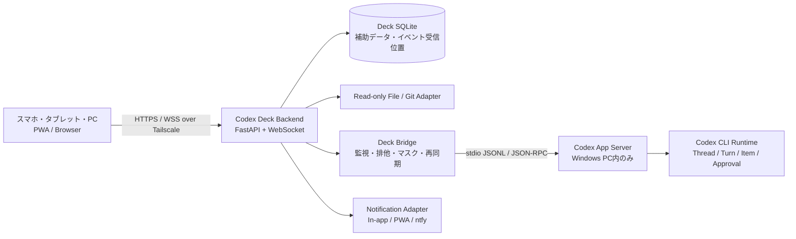

# Codex Deck 要件定義書

## 1. 文書情報

| 項目 | 内容 |
| --- | --- |
| プロジェクト名 | Codex Deck |
| リポジトリ名 | `Codex_Deck` |
| 文書版 | 0.1（実装前レビュー用） |
| 作成日 | 2026-07-13 (JST) |
| 対象フェーズ | 公式仕様調査、要件整理、設計方針の明文化。アプリ本体は実装しない。 |
| 関連資料 | [公式機能調査](../research/CODEX_OFFICIAL_CAPABILITY_RESEARCH.md)、[ユースケース](CODEX_DECK_USE_CASES.md)、[画面一覧・情報設計](../design/CODEX_DECK_SCREEN_MAP.md)、[PoC計画](../poc/CODEX_DECK_POC_PLAN.md)、[リスク一覧](CODEX_DECK_RISKS.md) |

本書の「必須」は初期リリース（MVP）の受入対象である。「PoCゲート」は実装開始前または対象機能の着手前に、公式互換性を実機で確認することを意味する。

## 2. 背景・目的・プロダクトビジョン

Codex Deckは、WindowsサーバーPC上で動作するCodexを、スマートフォン、タブレット、PCのブラウザから遠隔操作、監視、レビューするためのローカルファーストWebアプリケーションである。

これはリモートデスクトップでも独自AIエージェントでもない。Codex CLI、VS CodeのCodex拡張、Codex App Serverの公式概念・用語・承認/サンドボックスを保ったまま、モバイルの「依頼、進行確認、質問回答、承認、差分レビュー」に最適化したCodex Webクライアントとする。

### 2.1 成功状態

- 外出先のスマートフォンから、許可済みworkspaceを選び、Codexの新規作業を安全に開始できる。
- ブラウザやPWAを閉じても、Windows PC上のCodex作業は継続する。
- 再接続時に、作業状態、未読イベント、承認待ち、差分、テスト結果へ復帰できる。
- タブレットでは会話とコード/差分を同時にレビューでき、PCでは必要な範囲でVS Codeに近い多ペイン情報密度を得られる。
- Codex本来のThread、Turn、Item、approval policy、sandbox設定を正本とし、Deckが勝手に意味を変更しない。

### 2.2 最重要設計原則

1. **公式優先** — Codexの公式API・設定・用語を優先し、独自仕様は公式機能だけで不足する箇所に限る。
2. **Codexを正本とする** — Deckは独自の会話セッション、承認規則、アクセス権、Git制限を作らない。
3. **モバイルファースト** — PC画面の縮小版を禁止する。端末ごとに、最優先の意思決定と情報構造を変える。
4. **安全な遠隔操作** — App Serverを直接外部公開せず、Tailscale上のDeckを唯一の外部入口とする。
5. **切断に強い** — ブラウザ接続とCodex実行プロセスを分離し、重複実行より安全な中断・明示再開を優先する。
6. **人間向け閲覧は読み取り専用** — 初期リリースではWeb上の直接コード編集を提供しない。
7. **SMAIと完全分離** — リポジトリ、プロセス、ポート、DB、ログ、設定、起動・更新・障害復旧を共有しない。

## 3. 対象ユーザー・利用環境・用語

### 3.1 対象ユーザー

単一の個人開発者を第一対象とする。MVPは複数ユーザー共同編集、組織RBAC、SaaS化を対象外とする。ただし、端末紛失時にアクセスを無効化できる認証・端末管理を備える。

### 3.2 想定端末

| 区分 | 代表端末 | 主な目的 |
| --- | --- | --- |
| 小型スマートフォン | iPhone 13 mini相当 | 緊急確認、質問回答、承認、短い指示、インラインdiff確認 |
| 一般スマートフォン | 一般的なiPhone/Android | 依頼、監視、差分・ログの確認 |
| タブレット縦 | iPad第8世代相当 | 会話とコード/差分を並べたレビュー |
| タブレット横 | iPad横向き等 | ファイル、コード/差分、会話の三面レビュー |
| PCブラウザ | Windows Edge/Chrome | 複数ペインの監視・レビュー・管理 |

### 3.3 用語

| 用語 | 定義 |
| --- | --- |
| Workspace | ユーザーが開いたプロジェクトフォルダ。Gitリポジトリであることを必須としない。 |
| Thread / セッション | Codex App Serverの会話単位。UI上は「セッション」と表記してよいが、正本はCodex Thread。 |
| Turn | 1回のユーザー依頼と、それに続くCodexの作業単位。 |
| Item | 発言、ツール、コマンド、ファイル変更、承認等のCodexイベント単位。 |
| Deck Bridge | Codex Deckバックエンド内で、App Serverのstdio JSON-RPCを管理するプロセス境界。 |
| Active work | workspaceで実行中、停止中、承認待ち、質問待ちのいずれかにあるTurn。 |
| 補助データ | お気に入り、表示名、未読、通知、UIレイアウト、イベント受信位置等。Codex Thread本文の正本ではない。 |

## 4. スコープ

### 4.1 MVP対象

- workspace登録・選択、最近使用・お気に入り・状態表示
- Codex App Server接続、セッション一覧、新規/再開、指示送信、明示発言・進捗・Item表示
- Codex公式の承認要求への応答、追加指示、停止、バックグラウンド継続、再接続
- 読み取り専用のファイルツリー、コードビュー、検索、ファイル/行引用
- Git状態とdiff（スマホはインライン、タブレット/PCはside-by-side）
- Codex実行コマンドとログ、可能な範囲の構造化テスト結果
- PWA、端末別レイアウト、通知、Windows自動起動・ヘルスチェック・ログ・SQLite・Tailscale内アクセス

### 4.2 初期リリース対象外

- Web上での人間による直接コード編集、完全なVS Code互換、拡張機能マーケットプレイス
- 汎用Webシェル、任意コマンドの人間操作、独自AIモデル/独自エージェント、Codex以外のAI統合
- 一般インターネット公開、複数ユーザー共同編集、組織RBAC、課金、SaaS化
- Windows以外のサーバーの正式サポート、Gitの独自制限・自動PR/自動ブランチ強制
- Windows再起動後のCodexタスクの自動再実行、Codexの内部思考の表示

## 5. 推奨システム構成

### 5.1 採用推奨

| 層 | 推奨 | 理由 |
| --- | --- | --- |
| フロントエンド | React + TypeScript + Vite + PWA | モバイル優先コンポーネント、軽量配信、WebSocket UI、PWAに適する。Next.jsはサーバー描画等が明確に必要になった場合のみ再評価する。 |
| コード・diff表示 | Monaco Editorまたは同等の読み取り専用ビュー + dedicated diff viewer | 行参照、言語ハイライト、モバイル用インラインdiff、仮想化を実装しやすい。編集APIを露出しない。 |
| バックエンド | Python 3.11/3.12 + FastAPI + ASGI WebSocket | Windows運用、SQLite、Codex子プロセス管理、既存Python資産との親和性が高い。 |
| Codex連携 | App Server stdio JSONLのBridge | 公式既定transportであり、App Server WebSocketの実験的・未サポート性を外部利用者から隔離できる。 |
| 状態DB | SQLite（Deck専用） | 単一PC・単一ユーザーに十分。Thread本文を複製せず補助状態だけを保存する。 |
| 外部接続 | Tailscale HTTPS + Deck WSS | LAN/インターネット直公開を避け、App Serverをブラウザから隠す。 |
| 通知 | アプリ内通知を必須、PWA pushとntfyをadapterとして追加 | iOS制約時もアプリ内通知で情報欠落を防ぐ。SMAIのコード/DB/配送基盤は共有しない。 |

### 5.2 App Server接続方針

- Deck Bridgeは`codex app-server`を標準入出力で起動し、接続ごとに公式`initialize`/`initialized`を行う。
- App Serverの`--listen ws://...`はMVPの経路にしない。実験的・未サポートであり、非loopback listenerの認証設定が必要であるためである。
- BridgeはCLIバージョン、起動時刻、PID、handshake状態、直近イベント時刻、終了コードを記録する。
- App Server APIのスキーマはインストール済みCLIから生成してバージョンとともに保存・比較する。未知Itemは破棄せず、安全にマスクした「未対応イベント」として記録する。
- 1 workspace 1 active workの論理排他をDeck Schedulerが保証する。別workspaceの並行Turnを物理的に安全に実行できるプロセス構成はPoC-2で決定する。

### 5.3 Deck独自機能の責任分界

| 機能 | 公式Codex | Deck補助機能 | 互換性リスクと追従 |
| --- | --- | --- | --- |
| 会話・実行 | Thread、Turn、Item、承認、sandbox | 一覧整形、未読、表示名、検索UI、端末別レイアウト | App Server schemaをCLI更新ごとに再生成し、契約テストを行う。 |
| 再接続 | App Serverから得られるThread/Item状態 | ブラウザ向けイベント連番、永続outbox、重複排除、snapshot再読込 | 公式イベント再送は未保証。Deck側のevent IDはCodexの正本IDではないと明示する。 |
| Workspace | Codexの`cwd`とproject設定/AGENTS.md読み込み | 許可ルート、最近使用、favorite、Git集計 | cwd指定・複数worker時の挙動をPoCする。 |
| 通知 | Codexの作業・承認イベント | 通知分類、既読、quiet hours、PWA/ntfy配送 | Codexイベント種別変更に備え、未知種別を安全に扱う。 |

## 6. 機能要件

### 6.1 Workspace（FR-WS）

| ID | 要件 |
| --- | --- |
| FR-WS-01 | Workspaceはプロジェクトフォルダ単位とする。Gitリポジトリであることを必須としない。 |
| FR-WS-02 | フォルダを開く、最近開いたフォルダ、お気に入り、履歴、表示名、ルートパス、最終利用時刻、最後に使ったセッションを提供する。 |
| FR-WS-03 | Gitリポジトリでは、リポジトリ判定、ブランチ、未コミット変更数、Codex実行状態を一覧と詳細に表示する。非GitではGit欄をN/Aと明示する。 |
| FR-WS-04 | 初期の選択可能範囲は、管理設定の許可ルート配下かつユーザーが登録したフォルダに限定する。OS全体の自由探索を提供しない。 |
| FR-WS-05 | 新規フォルダ追加は、ルートパス、Git有無、読み取り制限、除外設定を確認する明示操作とする。許可ルート外の追加は管理者ローカル操作を必要とする。 |
| FR-WS-06 | 1 workspaceで同時にActive workは1件のみとする。保存済みセッション数は制限しない。異なるworkspaceはPoC成立後に並行実行を許可する。 |

**アクセス可能なフォルダの比較と決定**

| 案 | 安全性 | 使い勝手 | 決定 |
| --- | --- | --- | --- |
| 設定済み許可ルート配下のみ | 高い | 新規プロジェクト追加に一手間 | 採用の基礎。例: `C:\Users\user\workspace`。 |
| 初回に明示許可したフォルダのみ | 高い | 分散フォルダにも対応 | 許可ルート内の登録方式として併用する。 |
| 完全自由選択 | 低い | 高いが誤操作・秘匿ファイル閲覧の範囲が広い | 不採用。 |

### 6.2 セッション・同時実行（FR-SS）

| ID | 要件 |
| --- | --- |
| FR-SS-01 | セッション正本はCodex Threadとし、Deck DBはお気に入り、表示名、最終閲覧位置、未読、通知状態、UI設定だけを保存する。 |
| FR-SS-02 | セッション一覧は、タイトル、workspace、最終更新、実行/完了/中断/エラー/承認待ち/回答待ち、検索、filterを提供する。 |
| FR-SS-03 | 新規、既存再開、公式機能がある場合の分岐、公式アーカイブを提供する。削除はMVP対象外とし、アーカイブと混同しない。 |
| FR-SS-04 | `thread/start`、`thread/resume`、`thread/fork`、`thread/archive`/`unarchive`等の実際にサポートされる公式APIにのみ対応する。experimental APIはMVP必須にしない。 |
| FR-SS-05 | Schedulerはworkspace単位の排他鍵を持つ。実行中に別セッション開始を試みた場合は、対象セッションを表示し、停止、復帰待ち、または明示的な操作待ちを案内する。無断の強制停止・自動キュー化はしない。 |
| FR-SS-06 | 実行中への追加指示は公式`turn/steer`を利用可能な場合のみ提供する。送信受理、実行順、割込み、停止との競合、キューの有無はPoC結果に従う。 |
| FR-SS-07 | CLI/VS Code/Deck間のThread可視性・同時操作はPoC合格まで「相互利用を期待できるが保証しない」と表示する。 |

### 6.3 Codex操作・入力（FR-CX）

| ID | 要件 |
| --- | --- |
| FR-CX-01 | 指示送信、複数行、Markdown、コードブロック、ファイル参照、行参照、選択範囲参照、新規/再開/分岐、追加指示、停止、質問回答、承認応答を提供する。 |
| FR-CX-02 | 画像・添付ファイルはApp Server/対象モデル/モバイルブラウザの実機PoCで確認できた形式のみを有効化する。未対応時は送信前に明示する。 |
| FR-CX-03 | 入力欄は自動拡張、全画面入力、下書き自動保存、送信前プレビュー、Markdownプレビュー、過去指示再利用、テンプレート、貼付け、音声入力との共存を備える。 |
| FR-CX-04 | 日本語IMEの変換確定前はEnter送信しない。Enterの既定は改行、明示送信ボタンまたは設定済みショートカットで送信する。 |
| FR-CX-05 | キーボード表示時にもcomposerを可視に保ち、safe areaを考慮する。送信後は既定で入力をクリアするが、失敗・切断時は下書きを保持する。 |
| FR-CX-06 | Codexが質問や構造化入力を求めた場合、Thread/Turnに紐付く専用回答UIを表示する。回答の重複送信防止とタイムアウト状態を明示する。 |

### 6.4 実行表示・リアルタイム（FR-RT）

| ID | 要件 |
| --- | --- |
| FR-RT-01 | 表示対象はユーザー発言、Codexの明示発言、進捗、計画、ツール/コマンド、stdout/stderr、ファイル読取/変更、パッチ、Git差分、テスト、承認、質問、警告、エラー、完了結果とする。内部思考や非公開推論は表示しない。 |
| FR-RT-02 | BridgeはApp Server通知を受信順に永続イベント化し、Deck WebSocketで配信する。各Deckイベントにはworkspace、thread、turn、受信時刻、単調増加のDeck event ID、原イベント参照を付ける。 |
| FR-RT-03 | ブラウザは最後に確定受信したDeck event IDを保持し、再接続時に欠落分を取得する。重複はevent IDで排除し、順序不整合時はThread snapshotを再取得する。 |
| FR-RT-04 | 接続状態として、接続中、App Server接続、再接続中、切断、同期中、オフラインを常時識別できる。ブラウザのオフライン中に送信済みと見えるUIを禁止する。 |
| FR-RT-05 | 表示上の作業状態は待機中、調査中、実行中、コマンド実行中、テスト中、承認待ち、回答待ち、停止処理中、中断、完了、エラーを扱う。公式Item/Turn状態から導出できない状態は「推定」とせず接続状態として分離する。 |
| FR-RT-06 | heartbeat、指数バックオフ+jitter、ブラウザのbackground復帰時再同期、長時間接続の再認証を実装する。 |

### 6.5 承認・アクセスモード（FR-AP）

| ID | 要件 |
| --- | --- |
| FR-AP-01 | Codexのapproval policy、sandbox mode、permission profile、network/MCP関連の公式設定を正本として表示し、Deck独自の許可・拒否規則を設けない。 |
| FR-AP-02 | セッション開始時は、App Serverが実際に受け付けるアクセスモードだけを選択候補として表示する。セッション途中の変更可否も公式API/PoC結果に従う。 |
| FR-AP-03 | 承認画面はThread、Turn、理由、コマンドとcwd、ファイル変更、ネットワーク宛先、公式の決定肢を表示する。`accept`、`acceptForSession`、`decline`、`cancel`等の名前・意味を改変しない。 |
| FR-AP-04 | フルアクセス利用を可能にする。ただし画面ヘッダと承認ダイアログに`danger-full-access`相当の明確な状態バッジを常時表示する。 |
| FR-AP-05 | 承認履歴はDeck補助監査ログとして、決定者端末、時刻、Thread/Turn、公式決定値、対象要約を保存する。機密のコマンド出力や秘密情報はマスクする。 |

### 6.6 ファイル閲覧・Git差分（FR-FV / FR-GT）

| ID | 要件 |
| --- | --- |
| FR-FV-01 | Web上の人間によるファイル編集は初期リリースで提供しない。コードビューは常に読み取り専用であることを明示し、編集可能に見える操作部品を表示しない。 |
| FR-FV-02 | ファイルツリーは展開/折畳み、アイコン、Git状態、新規/変更/削除/未追跡、ファイル・フォルダ検索、`.gitignore`、除外設定、遅延読み込みを提供する。 |
| FR-FV-03 | symbolic link、バイナリ、巨大ファイル、文字コード、改行コードを安全に判定し、未対応/制限/プレビュー不可を明示する。許可ルート外へのlink追跡はしない。 |
| FR-FV-04 | コードビューは行番号、ハイライト、検索、行移動、折返し、フォントサイズ、コピー、選択/ファイル/行引用、行リンク、Codex参照・変更箇所の強調を提供する。横向きスマホ、ピンチズームまたはフォント調整に対応する。 |
| FR-GT-01 | Git状態としてrepository名、branch、detached HEAD、staged/unstaged/untracked数、ahead/behind、remote、直近commit、Codex実行Git操作を表示する。 |
| FR-GT-02 | HEAD、未コミット、staged、unstaged、新規、削除、rename、binary、必要時のcommit間/branch間diffを扱う。Git操作の可否はCodex設定と承認に従い、Deck独自のGit禁止を追加しない。 |
| FR-GT-03 | スマホはインラインdiff、タブレット/PCはside-by-sideを既定とする。長いdiffは折畳み、前後context、ファイル間移動、未確認件数、遅延読み込みを持つ。 |
| FR-GT-04 | 会話、ファイル、diffを相互リンクする。diff/ファイル/行の選択は、読み取り専用のままCodexへの修正依頼に引用できる。 |

### 6.7 コマンド・テスト（FR-EX）

| ID | 要件 |
| --- | --- |
| FR-EX-01 | Codexが実行したコマンドについて、コマンド、cwd、開始/終了、経過、終了コード、stdout、stderr、ANSI色、折畳み、検索、コピー、自動追従、仮想スクロールを表示する。 |
| FR-EX-02 | 複数のコマンド履歴、バックグラウンドプロセス、stdin要求、子プロセス、停止、強制終了、timeoutは、公式Item/APIで観測または制御できる範囲だけを表示・操作する。 |
| FR-EX-03 | 自由入力のターミナル、App Serverの`thread/shellCommand`、`command/exec`を利用者向けに公開しない。目的はCodexが実行したコマンドの表示・監視・承認である。 |
| FR-EX-04 | テスト結果は汎用parserを基本にし、検出できる場合はテストコマンド、成功/失敗/skip、時間、失敗一覧、error、stack trace、関連ファイル、Codex説明リンクを構造化する。 |
| FR-EX-05 | pytest等に特化した再実行/失敗のみ再実行は、Codexへの明示指示として行う。Web UIが直接テストコマンドを起動しない。全ログ表示への退避を必ず提供する。 |

### 6.8 通知・バックグラウンド・復旧（FR-NF / FR-RC）

| ID | 要件 |
| --- | --- |
| FR-NF-01 | 通知対象は質問、承認待ち、完了、失敗、Codex異常終了、テスト失敗、App Server切断/復旧、長時間作業完了、重要なbackgroundイベントに限定する。細かなファイル読取・各コマンドには通知しない。 |
| FR-NF-02 | アプリ内通知を必須とし、PWA pushとntfyを通知adapterとして提供する。種別ON/OFF、端末別設定、許可状態、URL/topic、quiet hours、重複抑止、既読、履歴、失敗ログ、対象セッション遷移を提供する。 |
| FR-NF-03 | SMAIとは通知コード、DB、topic設定、プロセスを共有しない。共通ライブラリ化は将来、独立パッケージとして提案・合意した場合のみ行う。 |
| FR-RC-01 | ブラウザ/PWAの終了、スリープ、通信切替、background化でCodexを終了しない。サーバー側Bridgeが仕事を管理する。 |
| FR-RC-02 | ブラウザ再接続時は最終event IDから未受信を補完し、必要に応じThread/Workspace/Gitの最新snapshotを取得する。 |
| FR-RC-03 | App Server切断は検知、再接続/再起動、既存Thread再取得、実行中Turnの可否確認、通知を行う。復旧不能は中断として記録する。自動的に依頼を再送しない。 |
| FR-RC-04 | Codexプロセス異常終了時は終了コード、マスク済みログ、孤立子プロセス確認、状態更新、通知を行う。自動再開しない。 |
| FR-RC-05 | Windows再起動後、前回のActive workは「中断」として表示し、直前ログ・Thread・再開操作を提示する。破壊的処理の重複を避けるため自動再実行は禁止する。 |

## 7. UI・UX要件

詳細は[画面一覧・情報設計](../design/CODEX_DECK_SCREEN_MAP.md)を正本とする。

| 端末 | 情報構造 | 必須UX |
| --- | --- | --- |
| スマートフォン | 1カラム、下部タブ「会話 / 作業 / 差分 / ファイル / 実行」 | composer下部固定、ファイルはdrawer、インラインdiff、承認待ち強調、未読/接続状態、safe area、誤タップ防止、横向き対応。 |
| タブレット縦 | 2ペイン | 左で会話/ファイル/作業切替、右でコード/diff/テスト。入力欄は下部または右下。 |
| タブレット横 | 3ペイン+下部補助 | 左ファイル、中央コード/diff、右会話/状況、必要時下部にコマンド/テスト。幅変更、折畳み、向き変更の状態保持。 |
| PC | 多ペイン | VS Codeに近いが、Codex操作・レビューに限定。全画面・layout保存、キーボード操作。 |

共通して、操作状態を色だけに依存せず、ラベル、アイコン、形状、読み上げラベルで示す。タップ領域、contrast、ライト/ダーク/OS追従、文字/コードフォント、focus、motion軽減、screen reader、エラー説明を考慮する。完全なWCAG準拠をMVPの必須にはしないが、主要操作不能を許容しない。

## 8. セキュリティ要件

| ID | 要件 |
| --- | --- |
| SEC-01 | 一般インターネットへ公開しない。Tailscale経由を基本とし、DeckとApp Serverのlisten範囲を分離する。 |
| SEC-02 | Tailscale identity headers、Deck独自ログイン、端末登録、ワンタイムtoken、passkeyを比較する。MVP推奨は「Tailscale認証を前提に、Deck側で端末登録済みかつ失効可能な短期セッション」をPoCで具体化する。 |
| SEC-03 | HTTPS/WSS、Origin検証、CORS最小化、WebSocket認証、CSRF、session fixation対策、レート制限、ログイン試行制限を実装する。 |
| SEC-04 | `App Server`は外部WebSocketで公開しない。Deck Bridgeだけがstdioで接続し、子プロセスのtoken・認証情報をブラウザへ送らない。 |
| SEC-05 | `.env`、SSH key、AWS/Git credential、Codex認証情報、ブラウザprofile、OSシステムフォルダはDeckの人間向けファイル閲覧でdeny/mask対象とする。Codexのsandbox権限とは別層である。 |
| SEC-06 | secret detector/maskerを、イベント受信、ログ保存、UI表示、通知本文、エクスポート前に適用する。検知不能を前提に生の全ログ公開をしない。 |
| SEC-07 | フルアクセス中であることを常時可視化する。Deckはフルアクセスの利用可否を独自に狭めないが、状態と影響範囲を隠さない。 |

## 9. データ・ログ・監視要件

### 9.1 Deck SQLiteの扱い

| 保存する | 保存しない |
| --- | --- |
| workspace登録、許可状態、最近使用、favorite、表示設定、端末設定、通知設定、未読、最終event ID、接続状態、障害/監査履歴、Thread表示名 | Codex会話本文の正本、Codex設定の複製、認証token、API key、フル未マスクのコマンド出力 |

- SQLiteはWAL、migration、atomic backup、integrity checkを備える。毎日世代バックアップ（最低7世代）と、更新前の手動バックアップを推奨する。
- DB障害時はCodex Threadを破壊せず、Deck補助情報を再構築できる状態とする。

### 9.2 ログ・監査

| 分類 | 必須フィールド | 推奨保持 |
| --- | --- | --- |
| application / bridge | UTC時刻、JST表示、level、request/event ID、workspace/thread/turn、masked detail | 30日 |
| Codex event / command | 受信順、元event参照、状態、終了コード、マスク状態 | 30日（容量上限を優先） |
| auth / WebSocket / approval | 端末、結果、IP/Tailscale identityの安全な識別子、decision | 90日 |
| notification | channel、event、配送結果、retry、失敗理由 | 30日 |
| error / health | service、PID、resource、restart、stack traceのマスク版 | 90日 |

内部保存はUTC、UIはJSTを既定とする。ログはローテーション、最大容量（初期推奨2GiB、設定可能）、古いログの削除、障害調査用のマスク済みエクスポートを持つ。

### 9.3 ヘルス監視

- Deck Backend: readiness、liveness、DB読書き、ディスク、ログ書込み、メモリ、CPU。
- Bridge: App Server handshake、PID、直近イベント、stderr異常、再起動回数。
- Scheduler: workspace lockの滞留、Turn timeout、孤立子プロセス。
- 通知: delivery success/failure、queue滞留、PWA permission状態。
- 起動失敗、復旧、連続再起動、残容量不足は重要通知の対象とする。

## 10. サーバー運用要件

### 10.1 SMAIからの完全分離

Codex Deckは別リポジトリ、別仮想環境、別プロセス、別ポート、別SQLite、別ログディレクトリ、別起動/更新/障害復旧設定とする。SMAIのソース、DB、ntfy topic、設定、launcherを直接参照・共有しない。

### 10.2 Windows自動起動方式の比較

| 方式 | 安定性・復旧 | 更新性 | Codexユーザー設定との適合 | 判断 |
| --- | --- | --- | --- | --- |
| Windowsサービス | 高いがservice account・sandbox・ログイン資格情報の設計が必要 | 中 | 既存ユーザーの`CODEX_HOME`とは乖離し得る | 将来候補。MVPの既定にしない。 |
| タスクスケジューラ（ユーザーログオン/再試行） | 高い | 高 | 個人ユーザーのCodex認証・設定を保ちやすい | **MVP推奨**。専用launcherとヘルス再起動を組み合わせる。 |
| NSSM | サービス再起動は強い | 中 | service account問題は残る | Windowsサービスへ移行する場合の候補。PoC後に再評価。 |
| 独自launcher | 要実装 | 高 | 高 | タスクスケジューラから起動する最小監視launcherとして採用。単独常駐方式にはしない。 |
| PowerShell常駐 | 低い | 高 | 高 | 開発時のみ。不採用。 |
| Docker | Windows native Codex/sandbox・ホストworkspace連携に追加複雑性 | 中 | 低〜中 | MVP不採用。 |

### 10.3 運用原則

- Windows起動またはログオン時にDeck Backend/Bridgeを起動し、異常終了はサービスプロセスだけ再起動する。
- Codexの実行中依頼を再起動後に自動で再送・再実行しない。
- ポート番号は設定可能な仮値とし、SMAIと衝突しない。初期設定例に固定ポートや個人絶対パスを記載しない。
- 更新は、maintenance状態、DB backup、プロセス停止、更新、schema互換確認、health check、ロールバック判定を含む手順とする。

## 11. 非機能要件

数値はPoCで測定し、初期リリース前に確定する暫定目標である。

| 区分 | 暫定要件 |
| --- | --- |
| 可用性 | Deck Backendはブラウザと独立し、通常作業中にブラウザ切断でCodexを止めない。連続再起動は検知・通知する。 |
| 性能 | Tailscale内で初期画面p95 3秒以内、workspace/session一覧p95 2秒以内、Bridge受信から可視化までp95 1.5秒以内を目標とする。 |
| 再同期 | 通常の再接続は10秒以内にsocket復帰、欠落イベント/最新snapshotの同期は30秒以内を目標とする。大量ログ時は進捗表示を優先する。 |
| 大規模repo | Smart_Market_AIでファイルツリー遅延読込、検索、巨大diff、長時間pytestログを操作不能なく扱う。大量表示は仮想化・chunk取得する。 |
| 信頼性 | ユーザー操作はidempotency keyまたは二重送信防止を持つ。停止・承認・回答はThread/Turnと要求IDに紐付ける。 |
| 復旧性 | App Server/Deck/Windows再起動の各ケースで、作業を勝手に再実行せず、中断・ログ・再開導線を残す。 |
| 保守性 | Bridge、Scheduler、File/Git、Notification、Authを明確に分離し、App Server schemaの契約テストとrecord/replayテストを持つ。 |
| テスト容易性 | 通常のunit/integrationはfake App Serverとfixtureでnetwork-freeにする。Tailscale、PWA push、実Codex、iOSはlive PoC/smokeとして分離する。 |
| 互換性 | iOS Safari/PWA、iPadOS Safari/PWA、Windows Edge/Chrome、Chromeを対象候補とする。OS/ブラウザ別制約はPoC結果をサポート表へ反映する。 |
| アクセシビリティ | 主要操作がキーボード、screen reader、拡大文字、dark/lightで利用可能。状態を色だけで表さない。 |

## 12. 制約・未決事項・将来拡張

### 12.1 制約

- App Server WebSocketが実験的・未サポートであるため、直接のモバイル接続は採らない。
- Codexが提供しないイベント再送、通知、モバイルUI、読み取り専用ファイル閲覧はDeck補助機能である。
- iOS/iPadOS PWAのpush、background、WebSocket保持、clipboard、download、service worker更新は端末/OSにより異なるためPoCで確認する。
- CodexのThread共有、同時クライアント競合、background terminal、実行中Turnの再接続は保証済みとして扱わない。

### 12.2 未決事項

1. 異なるworkspaceを並行実行するApp Server workerモデルと、同一`CODEX_HOME`への安全な同時アクセス。
2. CLI、VS Code、DeckのThread共有と、同時承認/停止/追加指示の競合規則。
3. Tailscale identity headerを使う具体的な公開方式と、Deckの端末失効方法。
4. iOS PWA notificationをMVP必須にするか、ntfy/アプリ内通知を代替にするか。
5. App Server Itemからテスト結果/差分/ファイル変更をどこまで構造化できるか。
6. Codexをタスクスケジューラのユーザーコンテキストで起動した際のsandbox・認証・更新の運用。

### 12.3 将来拡張

MVPの互換性と安全性が確認された後に、複数ユーザー、read-only共有、詳細なMCPフォーム、background terminal管理、ダウンロード/エクスポート、追加通知channel、Windowsサービス運用、他OSサーバー対応を評価する。これらをMVPへ混入させない。

## 13. 受入条件

1. [公式機能調査](../research/CODEX_OFFICIAL_CAPABILITY_RESEARCH.md)に、確認済み・PoC必要・未確認の区別とOpenAI公式URLがある。
2. 本書の機能要件が、workspace、session、Codex操作、表示、ファイル、Git、コマンド、テスト、承認、通知、background、通信断、PWA、運用、セキュリティ、ログ、性能、アクセシビリティを網羅する。
3. スマホ/タブレットを主要端末とし、PC縮小版ではないレイアウト要件が[画面設計](../design/CODEX_DECK_SCREEN_MAP.md)にある。
4. Codex Threadを正本とし、Deck DBが補助情報だけを保存することが明記されている。
5. 1 workspace 1 active work、読み取り専用Web編集、Codex公式アクセスモード、Git独自制限なし、Windows再起動後の自動再実行禁止が明記されている。
6. SMAIとの完全分離、MVP/非スコープ、リスク、未決事項、PoCゲートが明記されている。
7. このリポジトリにはアプリ本体、フレームワーク初期化、依存関係、実行用設定を追加しない。

## 14. 自己レビュー

| 観点 | 結果 |
| --- | --- |
| 要件網羅 | 指示書の機能・非機能・運用・セキュリティ・端末要件を、FR/SEC/NFRと関連文書へ整理した。 |
| 公式整合 | App Server WebSocketを安定前提にせず、stdio Bridgeを推奨した。Thread/Turn/承認の正本をCodexに置いた。 |
| 推測の管理 | セッション共有、複数クライアント競合、実行復帰、iOS PWAはPoC/未決事項として分離した。 |
| MVP境界 | 直接編集、汎用シェル、SaaS/RBAC、他OS、タスク自動再実行を対象外にした。 |
| 矛盾の扱い | 「別workspace並行」と「複数process共有」の物理実現は未確定のため、必須PoCゲートとして明記した。 |
